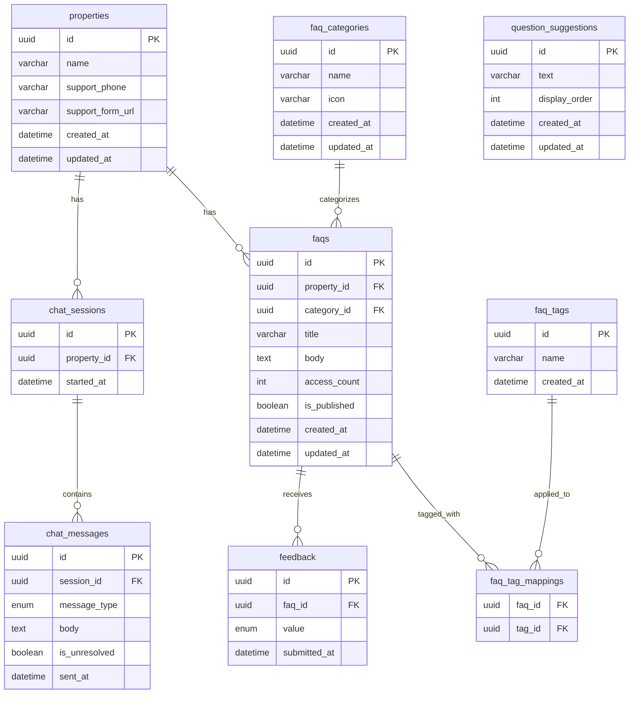

# DB設計書

> IPO一覧とデータ項目一覧から設計。P001〜P004（入居者向けテナントポータル）が対象。

## 設計方針

- IDは全テーブルで `UUID` を採用（分散・将来的なシャーディングへの対応）
- 文字列検索はMVPでは **MySQL FULLTEXT インデックス** を使用（日本語対応には `ngram` パーサーを使用）
- 正規化を優先（3NF）。Read Replica が未導入のためパフォーマンス目的の非正規化は行わない
- チャットメッセージはセッション終了後も論理的に保持するが、バッチ削除ポリシーはSprint 2以降で検討

---

## テーブル一覧

| テーブル名 | 目的 | 関連データ項目（data-list # ） |
|-----------|------|-------------------------------|
| `properties` | 物件情報とサポートデスク連絡先を管理 | #14, #15, #16, #17 |
| `faq_categories` | FAQのカテゴリ（設備・ゴミ出しなど）を管理 | #9, #10, #11 |
| `faq_tags` | FAQに付与するタグを管理（関連FAQ推薦に使用） | #12, #13 |
| `faqs` | FAQの質問・回答・メタ情報を管理 | #1, #2, #3, #4, #5, #6, #7, #8 |
| `faq_tag_mappings` | FAQとタグの多対多関係を管理する中間テーブル | #1, #12 |
| `feedback` | FAQ閲覧後の解決フィードバックを記録 | #18, #19, #20, #21 |
| `chat_sessions` | AIチャットのセッション単位を管理 | #22, #23 |
| `chat_messages` | チャットセッション内のメッセージを管理 | #24, #25, #26, #27, #28 |
| `question_suggestions` | P004チャット開始時のサジェスト質問を管理 | #29, #30, #31 |

---

## ER図

---

## テーブル詳細

### `properties`

**目的**: 物件情報とサポートデスク連絡先（電話番号・フォームURL）を管理する

| カラム | 型 | 制約 | 説明 |
|-------|-----|------|------|
| id | UUID | PK | 主キー |
| name | VARCHAR(255) | NOT NULL | 物件名（例：「○○ビル」） |
| support_phone | VARCHAR(20) | NOT NULL | サポートデスク電話番号 |
| support_form_url | VARCHAR(500) | NULL | 問い合わせフォームURL（任意） |
| created_at | DATETIME | NOT NULL, DEFAULT CURRENT_TIMESTAMP | 作成日時 |
| updated_at | DATETIME | NOT NULL, DEFAULT CURRENT_TIMESTAMP ON UPDATE CURRENT_TIMESTAMP | 更新日時 |

---

### `faq_categories`

**目的**: FAQをグループ化するカテゴリ（設備・ゴミ出し・駐車場など）を管理する

| カラム | 型 | 制約 | 説明 |
|-------|-----|------|------|
| id | UUID | PK | 主キー |
| name | VARCHAR(100) | NOT NULL, UNIQUE | カテゴリ名 |
| icon | VARCHAR(255) | NULL | カテゴリアイコンのコードまたはURL |
| created_at | DATETIME | NOT NULL, DEFAULT CURRENT_TIMESTAMP | 作成日時 |
| updated_at | DATETIME | NOT NULL, DEFAULT CURRENT_TIMESTAMP ON UPDATE CURRENT_TIMESTAMP | 更新日時 |

---

### `faq_tags`

**目的**: FAQに付与するタグを管理する。関連FAQ推薦のレコメンドロジックに使用する

| カラム | 型 | 制約 | 説明 |
|-------|-----|------|------|
| id | UUID | PK | 主キー |
| name | VARCHAR(100) | NOT NULL, UNIQUE | タグ名 |
| created_at | DATETIME | NOT NULL, DEFAULT CURRENT_TIMESTAMP | 作成日時 |

---

### `faqs`

**目的**: FAQの質問・回答・メタ情報（カテゴリ・公開状態・アクセス数）を管理する。システムの中核テーブル

| カラム | 型 | 制約 | 説明 |
|-------|-----|------|------|
| id | UUID | PK | 主キー |
| property_id | UUID | NOT NULL, FK → properties.id | 対象物件のID |
| category_id | UUID | NOT NULL, FK → faq_categories.id | カテゴリのID |
| title | VARCHAR(500) | NOT NULL | 質問タイトル（キーワード検索の対象） |
| body | TEXT | NOT NULL | 回答本文（マークダウン形式） |
| access_count | INT | NOT NULL, DEFAULT 0 | 閲覧回数（よく見られるFAQランキングに使用） |
| is_published | BOOLEAN | NOT NULL, DEFAULT FALSE | 公開フラグ（true: 入居者に公開） |
| created_at | DATETIME | NOT NULL, DEFAULT CURRENT_TIMESTAMP | 作成日時 |
| updated_at | DATETIME | NOT NULL, DEFAULT CURRENT_TIMESTAMP ON UPDATE CURRENT_TIMESTAMP | 更新日時 |

**インデックス**

| インデックス名 | 対象カラム | 種類 | 目的 |
|-------------|-----------|------|------|
| idx_faqs_property_id | property_id | INDEX | 物件別FAQ取得の高速化 |
| idx_faqs_category_id | category_id | INDEX | カテゴリ絞り込みの高速化 |
| idx_faqs_is_published | is_published | INDEX | 公開中FAQ絞り込みの高速化 |
| idx_faqs_access_count | access_count DESC | INDEX | よく見られるFAQランキングの高速化 |
| ft_faqs_title_body | title, body | FULLTEXT（ngram） | キーワード全文検索 |

---

### `faq_tag_mappings`

**目的**: FAQとタグの多対多関係を管理する中間テーブル

| カラム | 型 | 制約 | 説明 |
|-------|-----|------|------|
| faq_id | UUID | NOT NULL, FK → faqs.id | FAQのID |
| tag_id | UUID | NOT NULL, FK → faq_tags.id | タグのID |

**制約**: PRIMARY KEY (faq_id, tag_id)

**インデックス**

| インデックス名 | 対象カラム | 種類 | 目的 |
|-------------|-----------|------|------|
| idx_faq_tag_mappings_tag_id | tag_id | INDEX | タグからFAQを逆引きする関連FAQ推薦の高速化 |

---

### `feedback`

**目的**: FAQ詳細画面での「解決できた / できなかった」フィードバックを記録し、満足度計測に使用する

| カラム | 型 | 制約 | 説明 |
|-------|-----|------|------|
| id | UUID | PK | 主キー |
| faq_id | UUID | NOT NULL, FK → faqs.id | フィードバック対象のFAQ ID |
| value | ENUM('solved', 'unsolved') | NOT NULL | フィードバック値（解決できた / できなかった） |
| submitted_at | DATETIME | NOT NULL, DEFAULT CURRENT_TIMESTAMP | 送信日時 |

**インデックス**

| インデックス名 | 対象カラム | 種類 | 目的 |
|-------------|-----------|------|------|
| idx_feedback_faq_id | faq_id | INDEX | FAQ別フィードバック集計の高速化 |

---

### `chat_sessions`

**目的**: AIチャットのセッション単位を管理する。物件との紐づけにより、物件別のサポートデスク連絡先を引き継ぐ

| カラム | 型 | 制約 | 説明 |
|-------|-----|------|------|
| id | UUID | PK | 主キー（セッションIDとしてフロントエンドで保持） |
| property_id | UUID | NOT NULL, FK → properties.id | 対象物件のID |
| started_at | DATETIME | NOT NULL, DEFAULT CURRENT_TIMESTAMP | セッション開始日時 |

**インデックス**

| インデックス名 | 対象カラム | 種類 | 目的 |
|-------------|-----------|------|------|
| idx_chat_sessions_property_id | property_id | INDEX | 物件別セッション集計の高速化 |

---

### `chat_messages`

**目的**: チャットセッション内のメッセージ（ユーザーの質問・AIの回答）を時系列で管理する

| カラム | 型 | 制約 | 説明 |
|-------|-----|------|------|
| id | UUID | PK | 主キー |
| session_id | UUID | NOT NULL, FK → chat_sessions.id | 所属セッションのID |
| message_type | ENUM('user', 'ai') | NOT NULL | メッセージ種別 |
| body | TEXT | NOT NULL | メッセージ本文（ユーザー質問またはAI回答） |
| is_unresolved | BOOLEAN | NULL | AI未解決フラグ（AIメッセージのみ適用。NULLはユーザーメッセージを示す） |
| sent_at | DATETIME | NOT NULL, DEFAULT CURRENT_TIMESTAMP | 送受信日時 |

**インデックス**

| インデックス名 | 対象カラム | 種類 | 目的 |
|-------------|-----------|------|------|
| idx_chat_messages_session_id | session_id | INDEX | セッション内履歴取得の高速化 |
| idx_chat_messages_sent_at | sent_at | INDEX | 時系列ソートの高速化 |

---

### `question_suggestions`

**目的**: P004 AIチャット画面の開始時に提示するサジェスト質問を管理する

| カラム | 型 | 制約 | 説明 |
|-------|-----|------|------|
| id | UUID | PK | 主キー |
| text | VARCHAR(200) | NOT NULL | サジェスト質問テキスト |
| display_order | INT | NOT NULL, UNIQUE | 表示順序（昇順に表示、最大5件） |
| created_at | DATETIME | NOT NULL, DEFAULT CURRENT_TIMESTAMP | 作成日時 |
| updated_at | DATETIME | NOT NULL, DEFAULT CURRENT_TIMESTAMP ON UPDATE CURRENT_TIMESTAMP | 更新日時 |

---

## 正規化の確認

| 確認項目 | 結果 |
|---------|------|
| 第1正規形（繰り返し項目なし） | ✅ 配列データはfaq_tag_mappings中間テーブルで正規化済み |
| 第2正規形（部分関数従属なし） | ✅ 全カラムが主キーに完全従属 |
| 第3正規形（推移的関数従属なし） | ✅ 推移的依存なし。物件連絡先はpropertiesに集約 |
| 冗長データなし | ✅ サポートデスク連絡先はpropertiesで一元管理 |
