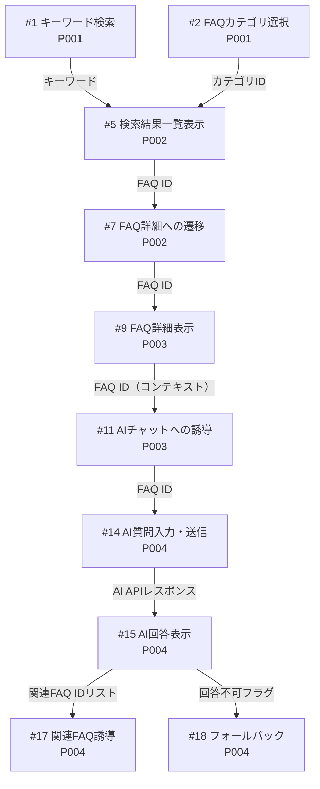

# Input / Process / Output 一覧

> 全機能のデータの流れと処理の内容を網羅する。P001〜P004（入居者向けテナントポータル）が対象。

## IPO 一覧

| # | 機能 | Page | Input | Process | Output |
|---|------|------|-------|---------|--------|
| 1 | キーワード検索 | P001 | 検索キーワード（テキスト、最大50文字、空白のみ不可） | バリデーション通過後、キーワードをクエリパラメータとしてP002へルーティング | P002（検索結果画面）への遷移 |
| 2 | FAQカテゴリ選択 | P001 | カテゴリID（タップ操作） | カテゴリIDをクエリパラメータとしてP002へルーティング | P002（カテゴリフィルタ済み）への遷移 |
| 3 | AIチャット起動 | P001 | タップ操作 | P004へルーティング | P004（AIチャット画面）への遷移 |
| 4 | よく見られるFAQ表示 | P001 | なし（ページロード時） | FAQ APIからアクセス数上位5件を取得 | FAQタイトルのリスト表示（最大5件） |
| 5 | 検索結果一覧表示 | P002 | キーワードまたはカテゴリID（URLクエリパラメータ） | FAQデータをキーワード全文検索またはカテゴリIDでフィルタし、関連度順に並び替え | 件数テキスト＋FAQカードリスト（タイトル・カテゴリタグ・冒頭テキスト2行） |
| 6 | 検索キーワード再入力 | P002 | 修正したキーワード（テキスト、最大50文字、空白のみ不可） | バリデーション通過後、クエリパラメータを上書きして再検索処理を実行 | 検索結果リストの更新（件数・カード一覧の再描画） |
| 7 | FAQ詳細への遷移 | P002 | FAQ ID（カードタップ） | FAQ IDをURLパラメータとしてP003へルーティング | P003（FAQ詳細画面）への遷移 |
| 8 | 0件時のAIチャット誘導 | P002 | なし（検索結果0件の状態） | 取得結果件数が0であることを検知 | 「見つかりませんでしたか？」メッセージ＋「AIに聞く」バナーボタンの表示 |
| 9 | FAQ詳細表示 | P003 | FAQ ID（URLパラメータ） | FAQ IDでFAQデータを取得。回答本文のマークダウンをHTMLへ変換 | タイトル・カテゴリタグ・回答本文（テキスト・番号付き手順・画像）の表示 |
| 10 | 解決フィードバック | P003 | 「解決できた / できなかった」選択（タップ） | FAQ IDとフィードバック値（solved / unsolved）をバックエンドへ送信し満足度DBを更新 | 選択ボタンのハイライト変化。「解決できなかった」選択時はサポートデスク連絡先を強調表示に切り替え |
| 11 | AIチャットへの誘導 | P003 | タップ操作 | 現在のFAQ IDをコンテキストパラメータとしてP004へルーティング | P004（AIチャット画面）への遷移。FAQ IDをコンテキストとして引き継ぎ |
| 12 | サポートデスク連絡先表示 | P003 | ページロード時（常時表示） | 物件IDに紐づくサポートデスク連絡先データを取得 | 電話番号（タップでOS電話アプリ起動）・問い合わせフォームURL（外部リンク）をページ下部に常時表示 |
| 13 | 関連FAQ表示 | P003 | FAQ ID（ページロード時） | FAQ IDに関連するFAQを最大3件取得（タグ・カテゴリベースのレコメンド） | 関連FAQのタイトルリンクリスト（最大3件） |
| 14 | AI質問入力・送信 | P004 | 質問テキスト（最大200文字、空白のみ不可）＋FAQ ID（P003からの遷移時のみ、URLパラメータ） | バリデーション通過後、質問テキストをAI APIへ送信。マニュアルデータをシステムプロンプトとして付与。FAQ IDが存在する場合は該当FAQ内容を追加コンテキストとして付与し回答生成 | ユーザー吹き出しの即時表示 → ローディングインジケーター表示 → AI回答吹き出し表示 |
| 15 | AI回答表示 | P004 | AI APIレスポンス（テキスト・回答不可フラグ・関連FAQ IDリストを含む） | レスポンスをパース・マークダウン変換（箇条書き・太字・改行）してHTML描画 | AI吹き出し（マークダウン対応テキスト）の表示。最新メッセージへ自動スクロール |
| 16 | 質問サジェスト表示 | P004 | なし（ページ初期表示） | よく聞かれる質問リストを静的データまたはAPIから取得 | 横スクロール可能なサジェストチップ（最大5件）の表示 |
| 17 | 関連FAQ誘導 | P004 | AI APIレスポンスに含まれる関連FAQ IDリスト | レスポンスから関連FAQ IDを抽出し、FAQ名を取得 | AI吹き出し直下に関連FAQリンクを最大3件表示 |
| 18 | フォールバック（AI未解決時） | P004 | AI APIレスポンス（回答不可フラグ） | APIレスポンスの回答不可フラグを検知 | サポートデスク連絡先バナー（電話番号・フォームリンク）をそのターンのAI吹き出し直後にチャット内挿入 |
| 19 | 会話履歴表示 | P004 | セッション内の全送受信データ（質問テキスト・AI回答テキスト・タイムスタンプ） | セッション中のメッセージを時系列配列で保持・描画。セッション終了時は破棄 | 全会話履歴のスクロール表示（ユーザー吹き出し右寄せ・AI吹き出し左寄せ） |

---

## データフロー接続図

機能間のInput/Outputの繋がりを整理する。

---

## 共通データ項目

複数の機能にまたがって使用される主要データ項目。

| データ項目 | 型 | 関連機能 | 備考 |
|-----------|-----|---------|------|
| FAQ ID | 文字列（ID） | #4, #7, #9, #10, #11, #12, #13, #14, #17 | P002→P003→P004 をまたいで伝播する中核ID |
| カテゴリID | 文字列（ID） | #2, #5 | P001でタップ→P002でフィルタに使用 |
| 検索キーワード | テキスト（最大50文字） | #1, #5, #6 | P001→P002間のクエリパラメータ |
| 物件ID | 文字列（ID） | #12 | サポートデスク連絡先の取得に使用。URLやセッションで保持 |
| フィードバック値 | 列挙型（solved / unsolved） | #10 | FAQ満足度の計測に使用 |
| AI APIレスポンス | JSON | #15, #17, #18 | 回答テキスト・関連FAQ IDリスト・回答不可フラグを含む |
| 質問テキスト | テキスト（最大200文字） | #14, #19 | 送信後は会話履歴に追加 |
