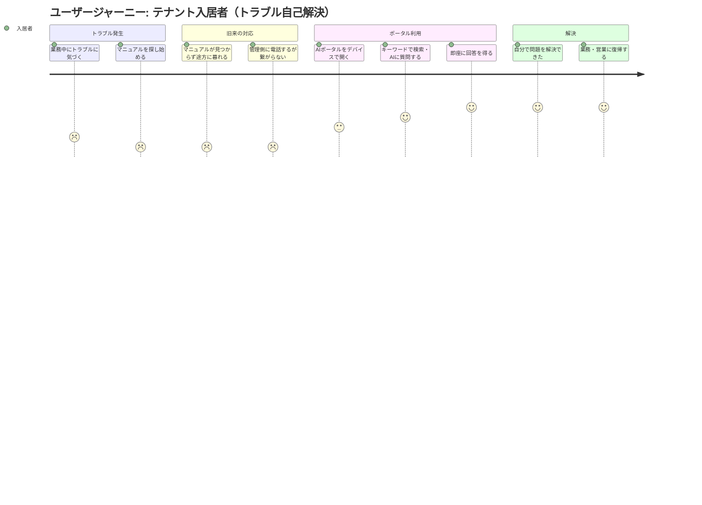
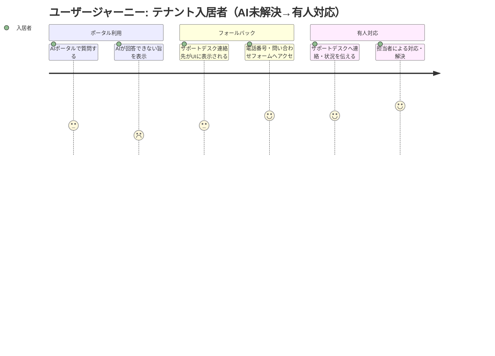
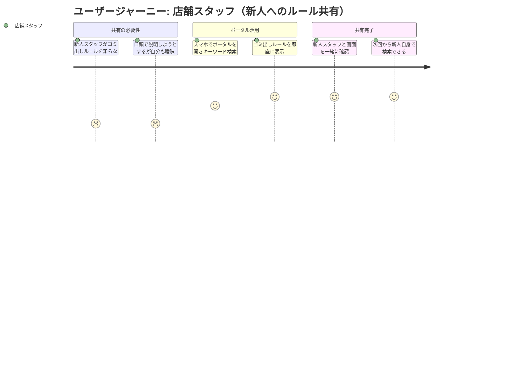
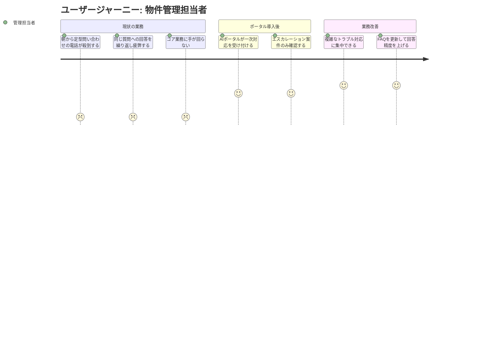

# ユーザージャーニー

---

## ジャーニー 1: テナント入居者

### ペルソナ

| 項目 | 内容 |
|-----|------|
| ペルソナ | 田中 美咲（オフィスワーカー）・山本 浩二（店舗スタッフ） |
| ユーザー像 | 三菱地所管理ビルのテナントに勤務する社員・スタッフ。業務中にトラブルや疑問が発生しても、紙マニュアルを探す時間も電話待ちの余裕もない |
| 課題 | 分厚い紙マニュアルから必要情報を探せない。管理側への電話が唯一の手段になっており、業務が度々中断する |
| 利用シーン | 業務中にトラブル発生（水漏れ、ゴミの出し方など）→即座に解決策を探したい |
| メインデバイス | オフィスワーカー：PC / スマホ　／　店舗スタッフ：スマホ（営業中のため手元でサッと検索） |

### ジャーニーマップ

#### A. トラブル自己解決フロー（共通）

#### B. AI未解決時のフォールバックフロー

#### C. 店舗スタッフ：新人スタッフへのルール共有フロー

### メインフロー（A: トラブル自己解決）

| # | フェーズ | 行動 | 課題・感情 | AIポータルによる解決 |
|---|---------|------|----------|------|
| 1 | トラブル発生 | 業務中にエアコン不具合・水漏れ・ゴミ出しルール不明などのトラブルに直面する | 「忙しいのに困った」「どうすれば...」焦りと困惑 | — |
| 2 | 情報を探す（旧来） | 分厚い紙マニュアルをめくって該当ページを探そうとする | 「どこに書いてあるか分からない」「時間がない」フラストレーション | — |
| 3 | 電話（旧来） | 見つからないので管理側に電話する | 「繋がらない」「待たされる」業務中断・ストレス増加 | — |
| 4 | ポータルにアクセス | デバイス（オフィスワーカー：PC/スマホ、店舗スタッフ：スマホ）からAIポータルを開き、キーワードを入力またはAIに質問する | 「使い方が分からなかったら困るな」軽い不安 | シンプルなUI・検索窓ですぐ操作できる |
| 5 | 即時回答 | AIが質問に対してマニュアルベースの回答を即座に返す | 「本当に答えが出てきた」驚きと安堵 | 24時間・即時・正確な回答 |
| 6 | 自己解決 | 案内された手順・情報に従って自分でトラブルを解決する | 「誰にも聞かずに解決できた」達成感・満足 | 手順が明確で行動に移しやすい |
| 7 | 業務復帰 | 問題を解決し、中断した業務・営業に戻る | 「これなら次も自分で解決できる」信頼感の醸成 | — |

### サブフロー（B: AI未解決時のフォールバック）

| # | フェーズ | 行動 | 課題・感情 | AIポータルによる解決 |
|---|---------|------|----------|------|
| 1 | AI未解決 | AIが「この質問には回答できません」と表示する | 「やっぱりダメか...」落胆 | 回答不可であることを明確に伝えて不安を軽減 |
| 2 | フォールバック提示 | UI上にサポートデスクの電話番号・問い合わせフォームのリンクが自動表示される | 「次の手が分かる」安心感・迷わずに済む | 連絡先への導線をシームレスに提示 |
| 3 | 有人対応へ引き継ぎ | 表示された連絡先からサポートデスクに連絡し、AIの回答ログを参考情報として共有する | 「ちゃんと繋いでもらえた」信頼感 | 問い合わせ内容の引き継ぎにより二度手間を防止 |

### サブフロー（C: 店舗スタッフによる新人ルール共有）

| # | フェーズ | 行動 | 課題・感情 | AIポータルによる解決 |
|---|---------|------|----------|------|
| 1 | 共有の必要性 | 新人スタッフがゴミ出しルールや設備利用方法を知らず、先輩に質問する | 「自分も細かいところは曖昧...」 | — |
| 2 | スマホで即検索 | スマホでポータルを開き、キーワードを入力して該当ルールを表示する | 「スマホですぐ出てきた」手軽さへの好感 | スマホ最適化UIで片手操作でも検索可能 |
| 3 | 画面を一緒に確認 | 新人スタッフと画面を共有しながらルールを確認する | 「これなら新人にも自分で調べてもらえる」 | URL共有・QRコードなどで新人自身も使えるよう誘導 |

### 感情の変化

- **開始時**：業務中のトラブルに直面し、焦りと困惑（スコア 2）
- **最初のつまずき**：マニュアルが見つからず電話も繋がらず、フラストレーション最大（スコア 1）
- **ブレークスルー**：AIポータルで即座に回答を得た瞬間（スコア 5）
- **AI未解決時**：連絡先がUIに表示されることで迷わず次の行動に移れる（スコア 3〜4）
- **ゴール達成時**：人を介さず自己解決できた達成感と、次回以降への信頼感（スコア 5）

---

## ジャーニー 2: 物件管理担当者

### ペルソナ

| 項目 | 内容 |
|-----|------|
| ペルソナ | 鈴木 健太（物件管理担当者） |
| ユーザー像 | 三菱地所の物件管理部に所属し、約200件の管理物件を担当。毎日定型的な電話問い合わせに追われて疲弊しており、コア業務に集中できていない |
| 課題 | 「マニュアルを見れば分かる」定型的な問い合わせ対応が業務の大半を占め、複雑なトラブル対応や施設管理などの本来業務が後回しになっている |
| 利用シーン | AIポータルへのFAQ登録・更新、AIが対応できなかったエスカレーション案件の確認と対応 |

### ジャーニーマップ

### メインフロー

| # | フェーズ | 行動 | 課題・感情 | AIポータルによる解決 |
|---|---------|------|----------|------|
| 1 | 朝の対応 | 出勤直後から「エアコンの使い方は？」「ゴミはどこに出す？」といった定型電話が殺到する | 「また同じ質問...」疲弊・消耗感 | — |
| 2 | 繰り返し対応 | 一日中、マニュアルに書いてある内容を電話で説明し続ける | 「この時間で別の仕事ができるのに」フラストレーション | — |
| 3 | ポータル導入 | AIポータルが入居者からの問い合わせを24時間受け付けて一次回答する | 「本当に減るのかな」期待と不安 | 定型的な問い合わせをAIが自動回答 |
| 4 | エスカレーション確認 | 管理画面でAIが解決できなかった案件・複雑な問い合わせを確認する | 「対応すべき案件が整理されている」安心感 | エスカレーション案件の一覧・優先度付け |
| 5 | コア業務への集中 | 複雑なトラブル対応・施設管理・テナント関係構築など本来の業務に集中できる | 「これが自分の仕事だ」充実感・専門性の発揮 | 定型対応の自動化により時間創出 |
| 6 | FAQ改善 | ポータルの回答ログを見てFAQの内容を追加・修正し、回答精度を継続的に高める | 「精度が上がっていく実感がある」前向きな継続意欲 | 管理UIで簡単にFAQ登録・更新が可能 |

### 感情の変化

- **開始時**：毎朝殺到する定型電話対応で出勤直後から消耗（スコア 1）
- **最初のつまずき**：AIに任せることへの不安・本当に減るのかという懐疑心（スコア 2）
- **ブレークスルー**：AIが一次対応を担い、自分のもとにはコア業務だけが届く状態の実感（スコア 4）
- **ゴール達成時**：本来の専門業務に集中でき、FAQ改善を通じて回答精度も上がり続ける充実感（スコア 5）
