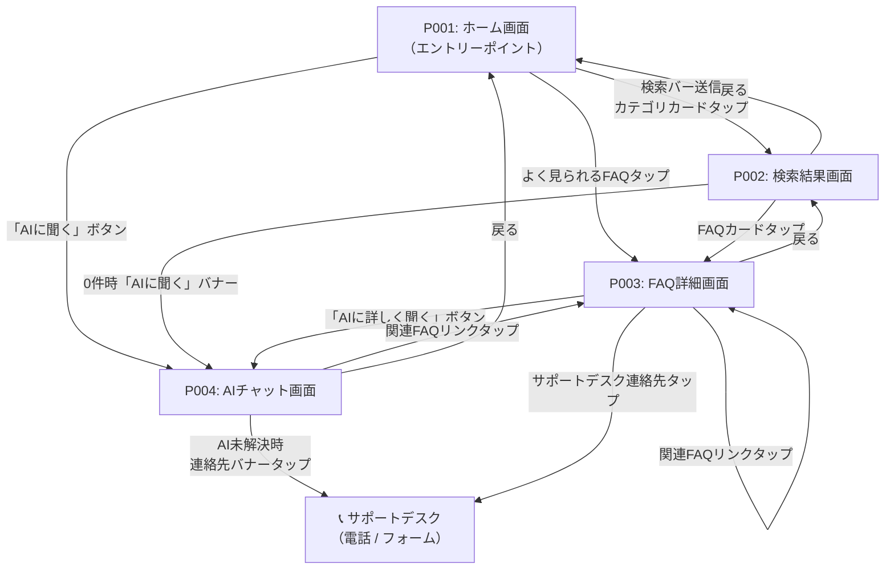

# 画面フロー・遷移図

## 概要

| 項目 | 内容 |
|------|------|
| プロジェクト | 三菱地所 テナントポータル |
| Sprint | Sprint 1（MVP） |
| 作成日 | 2026-04-23 |
| スコープ | 入居者向け（テナントポータル）4画面。管理者向け画面はMVP対象外 |

## ページリスト（確定版）

| ページID | ページ名 | 説明 |
|---------|---------|------|
| P001 | ホーム画面 | 入居者のエントリーポイント。検索・カテゴリ・AIチャットへのアクセスを提供 |
| P002 | 検索結果画面 | キーワード・カテゴリ検索の結果一覧を表示 |
| P003 | FAQ詳細画面 | FAQの詳細回答・手順を表示し自己解決を支援 |
| P004 | AIチャット画面 | AI質問・回答チャット。未解決時はサポートデスクへ誘導 |

### MVP対象外（Sprint 1では実装しない）

| ページID | ページ名 | 理由 |
|---------|---------|------|
| P005 | 管理者ログイン画面 | 管理者ポータルはSprint 2以降で対応 |
| P006 | 管理ダッシュボード | 同上 |
| P007 | FAQ管理画面 | 同上 |
| P008 | エスカレーション管理画面 | 同上 |

## ページ関係表

| ページ名 | 説明 | 遷移元 | 遷移先 | 遷移トリガー |
|--------|------|--------|--------|------------|
| P001 ホーム画面 | 入居者のエントリーポイント | なし（直接アクセス） | P002, P003, P004 | 検索バー送信 / カテゴリカードタップ / 「AIに聞く」ボタン / よく見られるFAQタップ |
| P002 検索結果画面 | 検索・カテゴリ絞り込みの結果一覧 | P001 | P003, P004 | FAQカードタップ / 0件時「AIに聞く」バナーボタン |
| P003 FAQ詳細画面 | FAQ詳細回答の表示と自己解決支援 | P001（よく見られるFAQ）, P002, P003（関連FAQ） | P004, P003（関連FAQ） | 「AIに詳しく聞く」ボタン / 関連FAQリンクタップ |
| P004 AIチャット画面 | AI質問・回答。未解決時に連絡先を提示 | P001（「AIに聞く」ボタン）, P002（0件誘導）, P003（「AIに詳しく聞く」） | P003（関連FAQリンク） | 関連FAQリンクタップ |

## ページ遷移図

## 補足

- 各Pageの詳細仕様は `specifications/{page-name}.md` を参照
- **モバイルファースト**：P001・P004はスマホでの片手操作を優先設計。タップ領域の最小サイズは44px以上
- **フォールバック導線**：P003・P004の両方からサポートデスクへの連絡先アクセスが可能で、入居者が詰まらない設計
- **サポートデスクへの遷移**はシステム外（電話発信・外部フォーム）のため遷移図では別ノードとして表記
- 管理者向け画面（P005〜P008）はMVP対象外。Sprint 2以降で設計・実装予定
